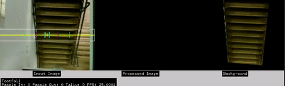

##Footfall

###Introduction

Footfall is a camera based people counting system that uses a Raspberry Pi and Pi Cam and openFrameworks. There is more information about the system on our [blog](http://blogs.wcode.org/2015/04/footfall-a-camera-based-people-counting-system-for-under-60/).

**Important**: The source code provides a barebones system that **will require some** customisation for each installation.

Built using openFrameworks 0.9.8.

###How to Customise
Inside the bin/data folder of the Footfall App there is a config.json file. This contains all of the relevant variables you will need to change.

Please see the [Configuration](./docs/config.md) section.

###Documentation
Find attached the relevant readmes to help build Footfall system.

* [Raspberry Pi](./docs/rpi.md)
* [Compiling](./docs/compiling.md)
* [Configuration](./docs/configuration.md)
* [Running](./docs/running.md)
* [Server](./docs/server.md)
* [Troubleshooting](./docs/troubleshooting.md)

###Thanks
Thanks to Kyle McDonald for [ofxCv](http://github.com/kylemcdonald/ofxCv) and George Profenza for [ofxCvPiCam] (https://github.com/orgicus/ofxCvPiCam).

###Warning
The original software was intended for sole use within **[Watershed](http://www.watershed.co.uk)**, therefore some of the source code has been altered for public use and differs slightly to our systems. For example our system generated event tags showing screening in conjunction with the total number of people in Watershed, to do this we had to pre-populate some timestamps and may cause an issue if the system is ran past a certain time.

##Fixes
####Update 1

I have added some new documentation about how to create the server side system  database etc... There is also a new guide about how to setup the raspberry pi as a server.

I will be updating this repo with more detailed instructions and improved tracking over the coming weeks.

####Update 2

#####15/09/16
I will updating the project to of_0.9.3 over the next coming weeks this should resolve some of the issues people have been having with ofxCv | ofXML.

####Update 3

#####13/02/17
I will updating the project to of_0.9.8 soon. There will also only be one version of Footfall that should work across all Pi Platforms.

In the mean time. If you are coming up against compiler errors for ofxCvPiCam and ofxCv, try moving the ofxCvPiCam libs then, download the latest ofxCv repo. If you are using an earlier version oF ie less than 0.9.8. checkout the VS2012-stable branch. If you are using 0.9.8 use the origin/stable branch this will negate the glm:: errors. 