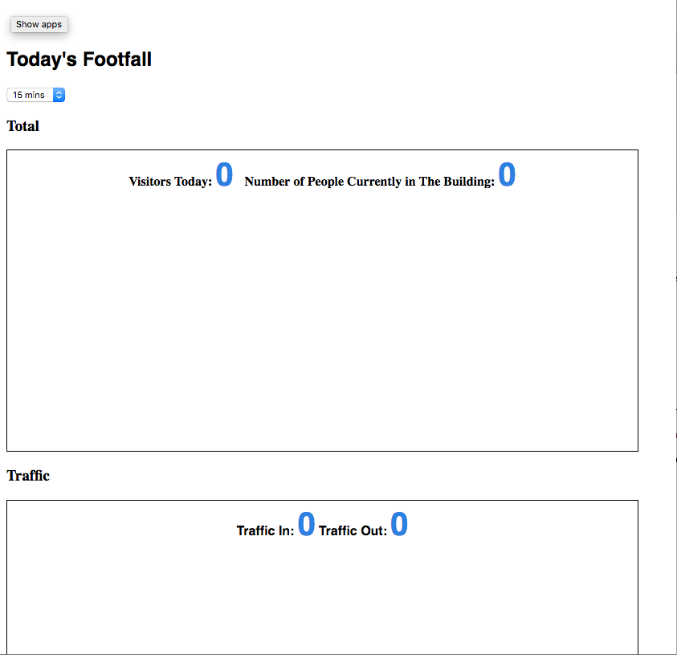

Footfall Server
===

This guide is requires a base knowledge of the command line.

###Option 1 - Local Server (Raspberry Pi)

If you don't have access to a webserver we can turn our raspberry pi into the footfall server.

To install you can either use a keyboard and mouse connected to the Raspberry Pi or connect to via SSH.

If you are using a keyboard and mouse open up LXTerminal.

####Install Apache

First you will need to update the Pi.

````
sudo apt-get update
sudo apt-get upgrade
````

Then grab Apache.

````sudo apt-get install apache2 -y````

####Install PHP

Nice and Easy this one.

````sudo apt-get install php5 libapache2-mod-php5 -y````

####Install MySQL

Again one command.

````sudo apt-get install mysql-server php5-mysql -y````

You will be prompted by some screens asking for names and passwords keep a note of these as they are important for later.

####Install phpmyadmin

You'll want a interface for the MySQL database so well install phpmyadmin.

````sudo apt-get install phpmyadmin````

When prompted select **apache2** and dbconfig-common set to **yes**

You'll be asked for the passwords you created earlier and to make another keep a note of them.

You'll need to restart the Apache server to launch phpmyadmin.

First lets add it to the apache config.

``sudo nano /etc/apache2/apache2.conf`

Somewhere near the bottom add the following line.

`Include /etc/phpmyadmin/apache.conf`

Then save the file by pressing CTRL + x then Y.

Then restart Apache.

`/etc/init.d/apache2 restart`

####Setup the database

If you are SSHing in to the Pi you will need to grab its IP address.

`ifconfig`


In your computers web browser go to 

`http://raspberrypiIP/phpmyadmin`

If you are on the Pi using a keyboard open a browser and go to

`localhost/phpmyadmin`

Login in using the credentials you made earlier.

Create a new database.

Choose your new database.

Then in the SQL panel, paste the following statement. <br>This will create the table for the event data.

````
CREATE TABLE IF NOT EXISTS `data` (
  `timestamp` timestamp NOT NULL DEFAULT CURRENT_TIMESTAMP,
  `locationID` tinyint(4) NOT NULL,
  `event` tinyint(4) NOT NULL,
  KEY `timestamp` (`timestamp`)
) ENGINE=InnoDB DEFAULT CHARSET=latin1;
````

####Public Files
You will need to move the contents of the public folder from the GitHub repo into the raspberry pi's webroot folder.

Now there are some contrasting reports that in Jessie the folder is in a different location to Wheezy. 

Both should be located in the this general area `/var/www/` or `/var/www/html`

Move into the webroot directory. For instance:

`cd /var/www/`
<br>or<br>
`cd /var/www/html`

Now we need to copy the contents across. This assumes you cloned the project from GitHub to your Raspberry Pi's /home/pi folder.

Inside `/var/www` do the following command

`sudo cp -r /home/pi/Footfall/Web/* .`

This should bring all of the relevant content across.

To whether this has worked or not.

Open a browser and go to `http://localhost/events.php` on the pi or `RaspberryPiIP/events.php` on your computer. You should see this screen.



Awesome we just need to change some variables around.

Open `sudo nano includes/dbconnect.php`

and change `$dbname` and `$password` to the ones you created earlier.

Save and exit.


###Option 2 - Dedicated Server

If you have access to a remote server all you will need to do is create a new database and move the contents of the public folder across to your server.

####Setup the Database

Open phpmyadmin for your server and create a new database.

Choose your new database.

Then in the SQL panel, paste the following statement. <br>This will create the table for the event data.

````
CREATE TABLE IF NOT EXISTS `data` (
  `timestamp` timestamp NOT NULL DEFAULT CURRENT_TIMESTAMP,
  `locationID` tinyint(4) NOT NULL,
  `event` tinyint(4) NOT NULL,
  KEY `timestamp` (`timestamp`)
) ENGINE=InnoDB DEFAULT CHARSET=latin1;
````

####Public Files
Using your favoured FTP Client (Transmit/Cyberduck). 

Create a subfolder on your server called **footfall**.

Drag and drop the contents of the public folder from the Github repo into the **footfall** folder.


